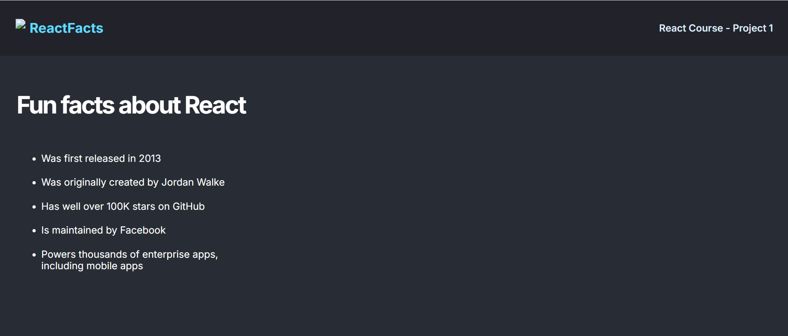

# React Info Design

Welcome to **React Info Design**! This project is a responsive web application built with React, styled using Bootstrap, and designed to provide users with an engaging and interactive experience.

## 🌟 Features

- **Responsive Design**: The application is fully responsive, ensuring a seamless experience across all devices, from desktops to mobile phones. This is achieved by inheriting and customizing Bootstrap for styling, making the design both modern and flexible.

- **Fun Facts Section**: The application includes a section dedicated to fun and interesting facts about React, providing users with valuable insights while they explore the app.

## 📸 Screenshots

  
## 🚀 Getting Started

### Prerequisites

Ensure you have Node.js and npm installed on your machine. You can check this by running:

```bash
node -v
npm -v
```

### Installation

1. Clone the repository:

```bash
git clone https://github.com/yourusername/React-Info-Design.git
```

2. Navigate to the project directory:

```bash
cd React-Info-Design
```

3. Install the dependencies:

```bash
npm install
```

### Running the Project Locally

To start the development server and run the project locally, use:

```bash
npm start
```

This will start the app on `http://localhost:3000`.

### Deploying to GitHub Pages

To deploy the project to GitHub Pages:

```bash
npm run deploy
```

This command builds the app and pushes it to the `gh-pages` branch of your repository, making it accessible at `https://username.github.io/React-Info-Design/`.

## 🎉 Fun Facts About React

1. **React was initially developed by Facebook**: React was first created by Jordan Walke, a software engineer at Facebook, and was initially deployed on Facebook's News Feed in 2011 and later on Instagram in 2012.

2. **Virtual DOM for Performance**: React uses a virtual DOM to optimize rendering performance. Instead of updating the actual DOM every time the state changes, React updates the virtual DOM, which is faster and more efficient.

3. **React is just the V in MVC**: Unlike full frameworks, React is just the view layer (the V in MVC). It handles rendering and updating the UI, leaving the model and controller logic to other libraries or your own custom implementation.

4. **React's Ecosystem**: React has a vast ecosystem with numerous libraries for state management (like Redux), routing (like React Router), and server-side rendering (like Next.js), making it extremely versatile.

5. **React Hooks**: Introduced in version 16.8, Hooks allow you to use state and other React features without writing a class. This was a game-changer, making functional components more powerful and easier to manage.

6. **Backward Compatibility**: One of React's strengths is its commitment to backward compatibility, ensuring that new versions don’t break existing codebases.

## 🛠️ Technologies Used

- **React**: JavaScript library for building user interfaces.
- **Bootstrap**: For responsive and mobile-first design.
- **GitHub Pages**: For deploying the project.
- **JavaScript (ES6+)**: The language used for building the app.
- **Webpack & Babel**: For bundling and compiling modern JavaScript.

## 📚 Additional Resources

- [React Documentation](https://reactjs.org/docs/getting-started.html)
- [Bootstrap Documentation](https://getbootstrap.com/docs/5.1/getting-started/introduction/)
- [Webpack Documentation](https://webpack.js.org/concepts/)
- [GitHub Pages Documentation](https://pages.github.com/).

## 🤝 Contributing

Contributions are welcome! If you'd like to contribute to the project, please fork the repository, create a new branch, and submit a pull request. Make sure to follow the code of conduct.
